# 🏔️ HimalayanCode: PahadiScript Web Interpreter

A web-based interpreter for the PahadiScript programming language, inspired by Himalayan coding traditions.

> **Code in the language of the mountains** - A complete web-based interpreter for PahadiScript, a Himalayan-inspired programming language.

##  Features

###  Core Interpreter
- **Lexical Analysis**: PLY-based lexer recognizing 20+ PahadiScript keywords
- **Syntax Parsing**: Complete CFG implementation with error recovery
- **Symbol Table**: Dynamic variable tracking with scope management
- **Code Execution**: Virtual machine for PahadiScript bytecode execution

###  User Experience
- **Web-based IDE**: Full-featured code editor with syntax highlighting
- **Real-time Execution**: Instant code compilation and execution
- **Program Management**: Save, load, and organize PahadiScript programs
- **Version Control**: Track changes and restore previous versions

###  Community Features
- **Program Sharing**: Generate shareable URLs and QR codes
- **Public Gallery**: Browse and fork community programs
- **Social Engagement**: Like, comment, and rate programs
- **Leaderboard**: Weekly challenges and user rankings

###  Analytics Dashboard
- **Personal Statistics**: Track your learning progress
- **Error Analysis**: Identify common programming mistakes
- **Performance Metrics**: Execution time and memory usage
- **Export Capabilities**: Download your code and data

###  Modern Interface
- **Responsive Design**: Works on desktop, tablet, and mobile
- **Theme Support**: Light, dark, and mountain themes
- **Accessibility**: Screen reader support and keyboard navigation
- **Multi-language**: Support for English and Himalayan languages

## System Architecture

```mermaid
flowchart TD
    Client[Client Layer] --> Presentation[ Presentation Layer]
    Presentation --> Application[Application Layer]
    Application --> Service[ Service Layer]
    Service --> Data[ Data Access Layer]
    Data --> Storage[ Storage Layer]
    
    classDef default fill:#000000,stroke:#ffffff
```

##  Detail Architecture Diagram

```mermaid
flowchart TD
    Client[Client Layer]
    Presentation[Presentation Layer]
    Application[Application Layer]
    Service[Service Layer]
    Data[Data Layer]
    Storage[Storage Layer]
    
    Client --> Presentation
    Presentation --> Application
    Application --> Service
    Service --> Data
    Data --> Storage
    
    subgraph Client
        Browser[Web Browser]
        Mobile[Mobile App]
        API[API Clients]
    end
    
    subgraph Presentation
        WebServer[Flask Server]
        Templates[Jinja2 Templates]
        Static[Static Files]
    end
    
    subgraph Application
        Lexer[Lexical Analyzer]
        Parser[Syntax Parser]
        Executor[Code Executor]
        Auth[Authentication]
        Profile[Profile Management]
    end
    
    subgraph Service
        UserService[User Service]
        CompilerService[Compiler Service]
        StorageService[Storage Service]
    end
    
    subgraph Data
        ORM2[SQLAlchemy ORM]
        Cache2[Redis Cache]
        Search2[ElasticSearch]
    end
    
    subgraph Storage
        DB2[SQLite Database]
        Files2[File System]
        NormalStorage[Normal Storage]
    end
    
    Browser --> WebServer
    Mobile --> WebServer
    API --> WebServer
    
    WebServer --> Templates
    WebServer --> Static
    
    WebServer --> Lexer
    Lexer --> Parser
    Parser --> Executor
    WebServer --> Auth
    Auth --> Profile
    
    Lexer --> ORM2
    Parser --> ORM2
    Executor --> ORM2
    Auth --> ORM2
    Profile --> ORM2
    
    ORM2 --> DB2
    ORM2 --> Cache2
    ORM2 --> Search2
    
    Profile --> Files2
    Static --> NormalStorage
    
    classDef default fill:#000000,stroke:#ffffff,stroke-width:2px
```

